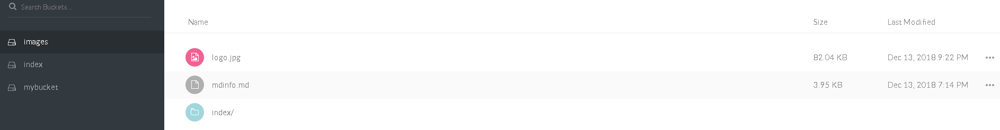
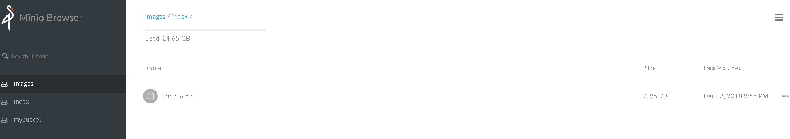
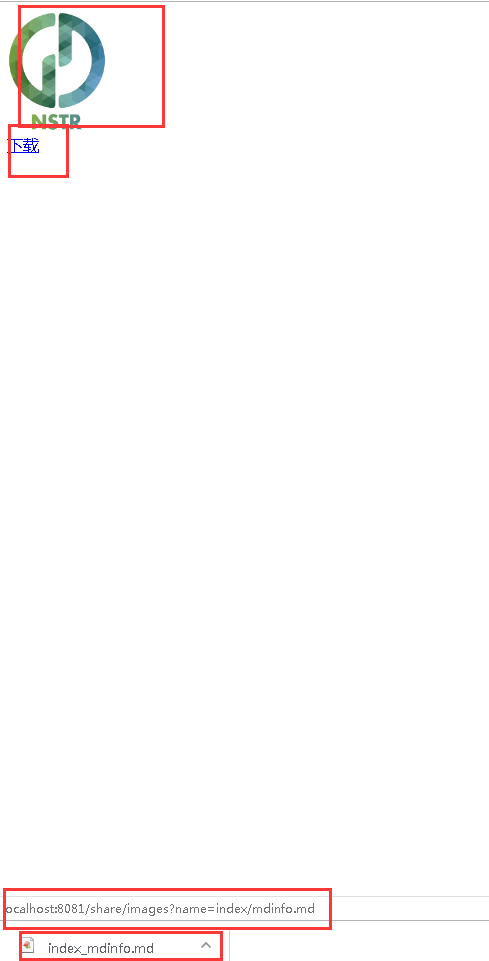

----------------
minio-fileserver
-----------------
项目说明：此项目是对minio存储的文件进行直接访问的一个服务项目，项目可作为中心可对外公开
的文件的存储方案。对于私密的文件可以自己保存在自己文件里面或者另外启动服务进行处理。
文件的上传不在这里做处理。每个项目可以查看开发文档来将文件存储到minio集群上。
在minio自己的客户端可以使用它提供的功能来直接在网站上查看文件。
但是那个url里面必须包含一定的参数。而且里面包含accessKey（虽然没有暴露secretKey），
且有一定过期的时间（最多七天），因此写了一个这个项目来对文件进行访问。

minio是一个分布式的文件存储的方案。暂时没有看到有提供直接的对外进行文件服务的设置功能。
最终访问文件的形式为如下：（其中8081是本项目服务的端口）
```html

<br />
<a href="http://localhost:8081/share/images?name=index/mdinfo.md">

```
在minio里面存储文件内容如下：
单层文件：最顶层



两层文件：



效果如下：




minio基本信息解释
---------------
(1) accessKey与secretKey可以用于登录。整个分布式的每个节点的ak与sk都是相同的。

(2)bucket:相当于最顶层的目录

(3)objectName:文件名，这里面包含文件的层级，比如share/upload/images/logo.png。
minio会创建这样的文件层级。

而本项目的使用也是这样的一个结构。bucket作为url里面的path，而objectName作为参数进行传递。
因为不清楚文件的层级，所以不直接使用文件的层级来使用。


API信息
-------
```js
var domain="https://storege.dataopen.cn";
var apis = [{"url":domain+"/share/{path}?name=fileName",
"description":"domain是域名（暂定是storege.dataopen.cn），share是固定的，" +
 "path是最顶层bucket信息，参数name是文件的名字。",
}]
```
minio简单使用DEMO
-----------------
（0）官网地址:[minio](https://www.minio.io/)；

java sdk:[minio-java](https://github.com/minio/minio-java)
（1）文件上传（单级与多级目录）：
```java
public class MinioTest{
    
    @Test
    public void test(){
        //获取客户端
        MinioClient minioClient = new MinioClient(
                "http://10.2.16.5:9001",//地址endpoint
            "escience123", "escience122",//ak sk
            false //是否使用ssl验证
            );
        //列出全部的bucket
        List<Bucket> bucketList = minioClient.listBuckets();
        for (Bucket bucket : bucketList) {
            System.out.println(bucket.creationDate() + ", " + bucket.name());
        }
        //查看bucket是否存在
        boolean found = minioClient.bucketExists("mybucket");
        //获取一个bucket下面的一个文件
        ObjectStat statObject = minioClient.statObject("mybucket", "mdinfo.md");
        System.out.println(statObject);
        if (found) {
            System.out.println("mybucket already exists");
        } else {
            //不存在就创建一个bucket
            minioClient.makeBucket("mybucket");
            System.out.println("mybucket is created successfully");
        }
        //上传文件使用putObject
        //单层目录结构
        minioClient.putObject("images","mdinfo.md","C:\\Users\\escience\\Downloads\\科搜系统众包模块文档.md");
        //多级目录在objectName里面设置，如下所示，如果没有则直接顶层目录即可
        minioClient.putObject("images","/index/mdinfo.md","C:\\Users\\escience\\Downloads\\科搜系统众包模块文档.md");
    }
}

```

